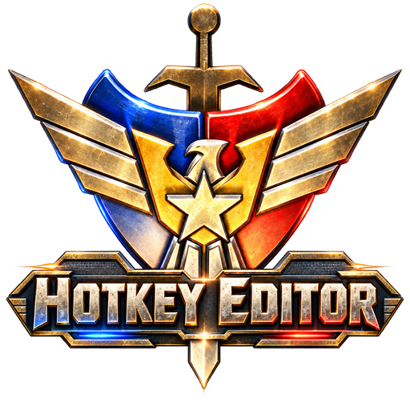
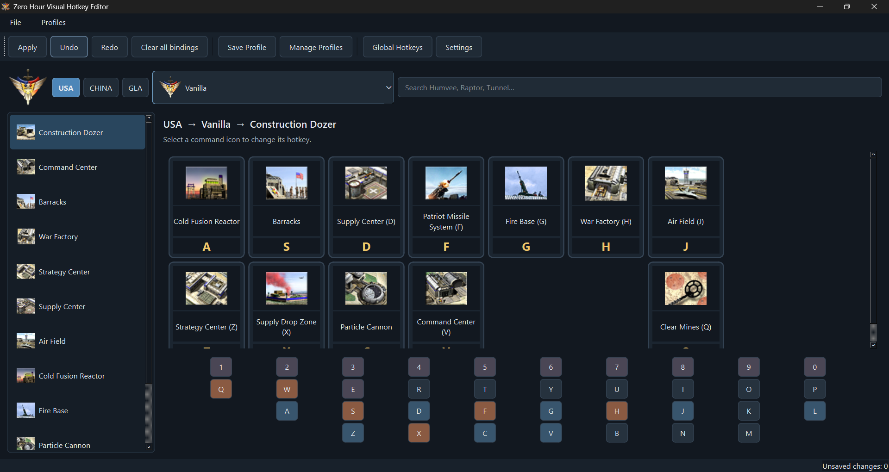
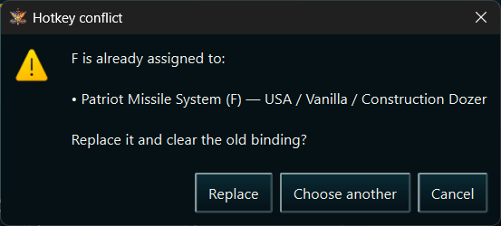
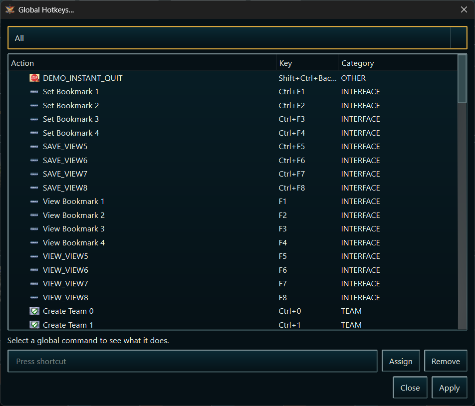
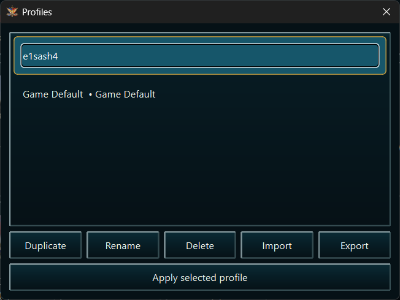
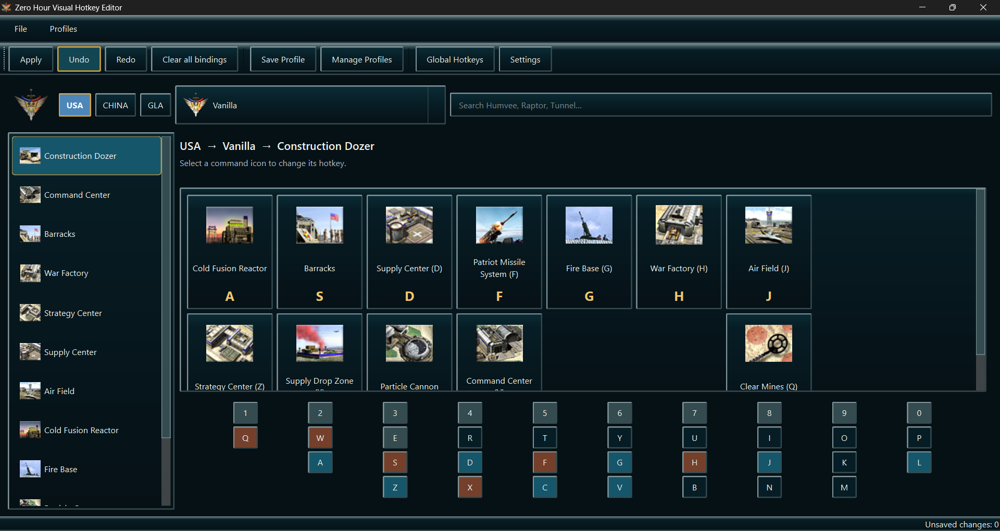
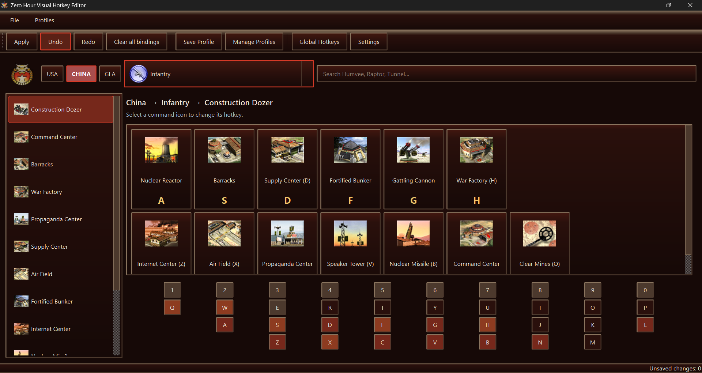
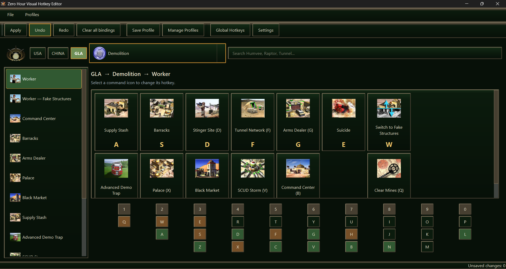

<div align="center">
  

  # Zero Hour Visual Hotkey Editor

  **A visual, safe, and faction-aware hotkey editor for<br>
  Command & Conquer: Generals — Zero Hour**

  [](https://www.microsoft.com/windows)
  [](https://www.python.org/)
  [](https://doc.qt.io/qtforpython-6/)
  [](LICENSE)

  [Download](https://github.com/e1sash4/Zero-Hour-Visual-Hotkey-Editor/releases) · [Report a bug](https://github.com/e1sash4/Zero-Hour-Visual-Hotkey-Editor/issues) · [Build from source](#building-from-source)
</div>

---

## Make Zero Hour hotkeys feel natural

Zero Hour normally stores command-bar shortcuts inside localized text resources. Editing them by hand means working with technical identifiers such as `CONTROLBAR:ConstructAmericaVehicleHumvee`, finding the correct text entry, and placing an ampersand in exactly the right location.

Zero Hour Visual Hotkey Editor turns that process into something familiar:

> **Choose a faction → choose a general → open a building → click the real unit icon → press a key.**

The editor reads the installed game, recreates its command-bar structure, extracts the required cameos locally, detects meaningful conflicts, and safely applies the result with an automatic backup.

<p align="center">
  <a href="docs/screenshots/main-window.png">
    
  </a>
  <br>
  <sub>The main workspace: faction navigation, real command icons, current bindings, and the interactive keyboard in one view.</sub>
</p>

## Highlights

### A visual command bar

- Browse commands using the game's real locally extracted unit, building, upgrade, and ability icons.
- Navigate by faction, general, and producer instead of internal INI or CSF identifiers.
- Use dedicated **Unit Actions**, **Building Actions**, and **Infantry Actions** pages for every official general.
- Keep command buttons in their in-game command-bar positions.
- Search for commands such as Humvee, Raptor, Overlord, Tunnel Network, and more.
- See producer icons, faction emblems, general portraits, and dedicated General Powers categories.

### Complete faction coverage

| Faction | Available armies |
| --- | --- |
| USA | Vanilla, Air Force, Laser, Superweapon |
| China | Vanilla, Tank, Infantry, Nuclear |
| GLA | Vanilla, Toxin, Stealth, Demolition |

Unused and debug factions are hidden from the normal interface.

### Fast hotkey editing

- Click a command card and press **A–Z** or **0–9** on the physical keyboard.
- Assign keys using the interactive on-screen keyboard.
- See which keys are unused, assigned, reserved, or conflicting.
- Right-click a virtual key to remove one specific binding or every binding assigned to it.
- Clear all faction command-bar bindings in one action.
- Use **Ctrl+Z** and **Ctrl+Y** before applying changes.

### Mouse button bindings

Mouse bindings are **enabled by default on the first launch** and can be turned
off at any time in Settings.

- Assign command-bar actions to the standard **M3**, **M4**, and **M5** mouse buttons.
- Use the clickable mouse diagram beside the virtual keyboard to select a button.
- Keep the editor running while playing. Remapping is active only while Zero Hour is the foreground application.
- Change the internal proxy keys in Settings. The less commonly used **7**, **8**, and **9** keys are selected by default.
- If Zero Hour runs as administrator, run the editor as administrator too so Windows permits input forwarding.

The editor translates M3/M4/M5 presses into hardware-style keyboard scan codes
for compatibility with Zero Hour's legacy input handling. Windows exposes only
these three extra buttons through its standard mouse API. Map additional
vendor-specific mouse buttons to keyboard keys in the mouse manufacturer's
software.

### Context-aware conflict detection

The editor understands that the same key can be valid in different command sets. A key used by the USA Dozer does not automatically conflict with the same key in the USA Barracks.

When two commands really can appear together, the editor shows where the key is already used and lets you replace the old assignment or choose another key. It also detects shared CSF labels, where changing one shortcut necessarily affects several commands.

<p align="center">
  <a href="docs/screenshots/conflict-warning.png">
    
  </a>
  <br>
  <sub>A conflict identifies the existing command and lets the user replace it, choose another key, or cancel.</sub>
</p>

### Global game controls

Command-bar hotkeys and global controls are both supported. The Global Hotkeys window reads `CommandMap.ini` and exposes actions such as attack, guard, selecting unit types, camera controls, and other game-wide shortcuts. Global changes have their own validation and backups.

<p align="center">
  <a href="docs/screenshots/global-hotkeys.png">
    
  </a>
  <br>
  <sub>Search, inspect, assign, and remove game-wide keyboard shortcuts.</sub>
</p>

### Safe by design

- Changes remain in memory until **Apply** is pressed.
- A timestamped backup is created before writing.
- New CSF and CommandMap files are validated before replacing an existing override.
- Writes use temporary files and atomic replacement.
- Restore the latest backup or return to the archive-provided original.
- If Windows blocks writes to a protected game folder, the editor preserves the
  finished configuration and offers to restart with administrator privileges.
  If elevated installation is still blocked, it opens the saved files and shows
  the exact game paths where they can be copied manually.
- The original BIG archives are never modified or repacked.

### Profiles, languages, and themes

- Save logical hotkey layouts as lightweight JSON profiles.
- Duplicate, rename, import, export, delete, and apply profiles.
- Preserve the detected original layout as a read-only **Game Default** profile.
- Switch the application between **English**, **Ukrainian**, and **Russian**.
- Choose **Modern Dark**, **Light**, or the faction-reactive **Zero Hour** theme.
- Enable Developer Mode when technical IDs and asset sources are needed.

<p align="center">
  <a href="docs/screenshots/profile-manager.png">
    
  </a>
  <br>
  <sub>Reusable layouts can be managed and shared without distributing a modified game file.</sub>
</p>

### Faction-reactive Zero Hour theme

The Zero Hour theme changes its colors and visual accents to match the currently selected faction.

<table>
  <tr>
    <th width="33%">USA</th>
    <th width="33%">China</th>
    <th width="33%">GLA</th>
  </tr>
  <tr>
    <td><a href="docs/screenshots/zero-hour-usa.png"></a></td>
    <td><a href="docs/screenshots/zero-hour-china.png"></a></td>
    <td><a href="docs/screenshots/zero-hour-gla.png"></a></td>
  </tr>
</table>

## Installation

### Download a Windows release

1. Open the [Releases page](https://github.com/e1sash4/Zero-Hour-Visual-Hotkey-Editor/releases).
2. Download `ZeroHourHotkeyEditor-v0.2.0-Windows.zip` (or the newest available version).
3. Extract the **entire** archive to a normal folder.
4. Run `ZeroHourHotkeyEditor.exe` from the extracted folder.

The release uses reliable one-folder packaging. Keep the executable and its accompanying DLLs and folders together. Do not run the executable directly from inside the ZIP archive.

### First launch

The editor attempts to detect Steam and EA installations automatically. If detection fails, select the folder containing the Zero Hour installation manually.

During the first launch it will:

1. index relevant BIG archives;
2. parse game INI definitions;
3. build the faction and command database;
4. extract only the icon atlases referenced by visible commands;
5. crop and cache the required icons;
6. read current command-bar and global hotkeys.

Indexing runs in the background, so the interface remains responsive. Cached icons are reused on later launches.

## Using the editor

1. Select **USA**, **China**, or **GLA**.
2. Select the vanilla faction or one of its three generals.
3. Choose a producer, **General Powers**, **Unit Actions**, **Building Actions**, or **Infantry Actions**.
4. Click the command you want to edit.
5. Press a key on the physical or virtual keyboard.
6. Resolve a conflict if the selected key is already used in the same context.
7. Review the unsaved-change counter and press **Apply**.

Restart Zero Hour after applying changes so the game reloads its localized command data.

## No Electronic Arts assets are distributed

This repository and its Windows builds do **not** include original Zero Hour images, audio, string tables, or other copyrighted game resources.

Icons and faction artwork are obtained only from the user's legally installed copy of the game and cached locally. Deleting the icon cache is safe: the editor can rebuild it from the installed game files.

Relevant resources commonly include:

- `INIZH.big` and patch INI archives;
- `EnglishZH.big` or the selected language archive;
- `TexturesZH.big` and relevant UI texture archives;
- `CommandButton.ini`, `CommandSet.ini`, Object INIs, and MappedImage definitions;
- `generals.csf` and `CommandMap.ini`.

## How it works

```text
Faction / General
        ↓
Producer Object → CommandSet → CommandButton
        ↓                            ↓
in-game slot                   ButtonImage + TextLabel
                                     ↓          ↓
                              MappedImage     generals.csf
                                     ↓          ↓
                               cropped icon   current hotkey
```

### BIG archives

`core.big_reader.BigArchive` provides read-only support for the BIGF and BIG4 formats used by SAGE games. It validates archive boundaries and exposes enumeration, case-insensitive lookup, search, and extraction of individual files to memory. FinalBIG is not required.

### Automatic icon extraction

MappedImage definitions identify an atlas texture and a `Left/Top/Right/Bottom` rectangle. Pillow decodes the referenced TGA, handles image orientation, crops the requested region, converts it to PNG, and stores it in the local cache. Only images referenced by visible commands are requested.

If a mapping or texture cannot be found, the application displays a readable placeholder and records a diagnostic warning instead of crashing.

### CSF hotkeys

Zero Hour treats the character following `&` in a localized CSF string as its command-bar mnemonic. The editor reads and writes the game's CSF format, preserves unrelated labels and metadata, and inserts a conventional suffix such as `(&F)` when the chosen character is not present in the visible command name.

Apply creates a loose override under the selected game's language data directory. The shipped archive remains untouched.

## Customizing faction layouts

The stock command database is discovered from the game automatically. Two small override files keep the visible presentation accurate when the original data is ambiguous:

- `data/overrides/producers.json` controls which producer CommandSets are shown for each faction and general, as well as their order.
- `data/overrides/layouts.json` controls visible commands and their `[row, column]` positions inside a CommandSet.

The aggregated Unit, Building and Infantry pages use per-general identifiers
such as `ActiveActions/USA/Air Force/Unit Actions`. Remove that identifier from one general in
`producers.json` to hide the whole page. In `layouts.json`, remove a
`CONTROLBAR:` entry to hide one action, or change its coordinates. Rows and
columns are zero-based and additional rows are supported. Each official general
has its own independent block.

These files contain technical identifiers only; they do not contain copyrighted textures or localized game text. They can be edited to correct a position, hide a command unavailable to a particular general, or add a valid command discovered in the installed game data.

## User data and backups

Packaged releases store generated data under:

```text
%LOCALAPPDATA%\ZeroHourHotkeyEditor\
├── backups\
├── backups-command-map\
├── cache\icons\
├── data\profiles\
└── logs\app.log
```

Development runs use equivalent folders beside the repository. Profiles contain logical `TextLabel → key` mappings rather than copies of `generals.csf`.

## Building from source

### Requirements

- Windows 10 or Windows 11
- Python 3.12 or newer
- A legal local installation of Command & Conquer: Generals — Zero Hour

### Development setup

```powershell
git clone https://github.com/e1sash4/Zero-Hour-Visual-Hotkey-Editor.git
cd Zero-Hour-Visual-Hotkey-Editor
python -m venv .venv
.venv\Scripts\Activate.ps1
python -m pip install -r requirements.txt
python -m pytest -q
python main.py
```

The detector checks known registry entries, common EA and Steam locations, Windows drive letters, and the optional `ZERO_HOUR_PATH` environment variable. A manually selected path is remembered for later launches.

### Build the Windows application

Run:

```bat
build.bat
```

The build script installs dependencies into `.venv`, runs the test suite, and produces:

```text
dist\ZeroHourHotkeyEditor\ZeroHourHotkeyEditor.exe
```

To distribute the application, ZIP the complete `dist\ZeroHourHotkeyEditor` directory. The game itself and its assets are never included in this output.

## Project structure

```text
app/       startup, paths, translations, themes, main window, background indexing
ui/        command cards, command grid, keyboard, settings, conflict and profile dialogs
core/      game detection, BIG/INI/CSF parsing, assets, hotkeys, profiles and backups
models/    parser-independent application data models
data/      presentation overrides and user-created logical profiles
assets/    original application branding only; no game assets
tests/     synthetic fixtures and automated tests
```

The GUI does not contain game-file parsing logic. Binary formats, logical hotkey operations, backups, and profiles remain separated from Qt widgets so they can be tested independently.

## Testing

Run the complete test suite with:

```powershell
python -m pytest -q
```

Tests use small synthetic fixtures and cover BIG archive validation, INI blocks, MappedImages, CommandButtons and CommandSets, CSF serialization, mnemonic manipulation, context-aware conflicts, shared labels, undo/redo, grid layouts, profiles, and atomic backup/restore. No test fixture is copied from Zero Hour.

## Current scope

- English Zero Hour game resources are the most thoroughly tested. The application interface itself supports English, Ukrainian, and Russian.
- Command-bar mnemonics support single **A–Z** and **0–9** characters. Function-key mnemonics are not written without a verified game representation.
- The built-in army list targets the twelve official Zero Hour factions and generals. Total-conversion mods may require additional classification overrides.
- An automatic configurable grid-preset designer is planned; profiles already provide the storage model needed for it.

## Contributing

Bug reports and verified layout corrections are welcome. When reporting incorrect faction content, include the faction, general, producer, CommandSet ID, expected slot, and—when possible—a screenshot from the game.

Please do not submit extracted EA textures, CSF files, audio, or other copyrighted game resources. Contributions should contain code, synthetic test data, and technical mappings only.

## License

The application source code is available under the [MIT License](LICENSE).

Command & Conquer, Generals, Zero Hour, and related names and artwork are trademarks or copyrighted materials of Electronic Arts Inc. This is an independent fan-made utility and is not affiliated with, endorsed by, or sponsored by Electronic Arts.

## Technical references

- [OpenSAGE BIG format documentation](https://github.com/OpenSAGE/Docs/blob/master/file-formats/big/index.rst)
- [TheAssemblyArmada/Thyme CSF format documentation](https://github.com/TheAssemblyArmada/Thyme/wiki/Compiled-String-File-Format)
- [GenHotkeys](https://github.com/MahBoiDeveloper/GenHotkeys) — consulted for behavior and format research; no GPL source code was copied.
